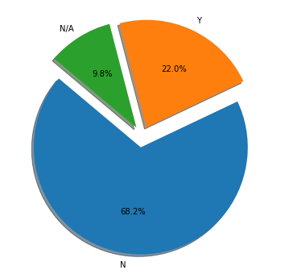
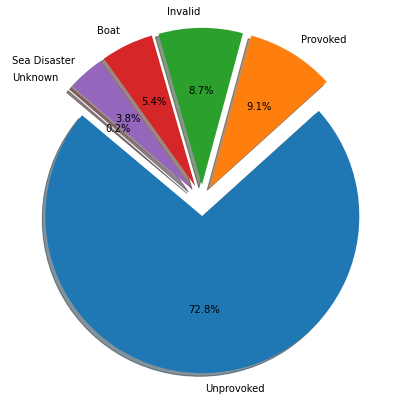

# Shark Attacks Project I 

## Data Cleaning and Manipulation with Pandas
En este proyecto, vamos a manipular y limpiar un conjunto de datos para posteriormente analizarlo y poder sacar diferentes conclusiones. 

## Intro
La finalidad del ejercicio es poner en prática todo lo aprendido sobre **exploración, limpieza, análisis y visualización de datos.**
Para ello, hemos tenido que importar un archivo de datos facilitado por Kaggle, que contiene registros globales de ataques de tiburones. La fuente es la siguiente: https://www.kaggle.com/datasets/teajay/global-shark-attacks

## Requisitos:
1. Borrar columnas solo si tienen más del 80% de valores nulos.
2. Mínimo tiene que tener 6.000 mil filas.
3. Tiene que tener el mismo tipo de dato en la columna

## Objetivo:
Saber cual es la especie de tiburón más peligrosa y analizar el % de incidencia que tiene según el género de la victima y la probabilidad de que sea ataque mortal o no.

## Procedimiento:

**1. Exploración y limpieza:**

1.1 Realizamos una exploración del tamaño y calidad de los datos.

1.2 Así mismo, recorreremos el archivo por columnas, evaluando la mejor manera de limpiar y extraer la mayor cantidad de datos para nuestra visualización. 

1.3 Eliminaremos aquellas columnas que tengan más del 80% de valores nulos y no nos influya en nuestro análisis. Antes de proceder a eliminar las columnas, eliminamos aquellas filas que tengan valores nulos en todas las columnas. Eliminamos también los duplicados, ya que nos puede influir a la hora de hacer el análisis.

1.4 Pasamos de tener cerca de 26mil filas a unas 6mil filas. Las únicas columnas que eliminamos serán UNNAMED:23 y UNNAMED:22 ya que tienen un 99% nulo y posteriormente modificaremos los nombres de las columnas para poder hacer una mejor manipulación a lo largo del ejercicio.

1.5 Renombramos los valores en la columna TYPE para una mejor interpretación y reemplazamos todos los valores null por Unknown. También los datos de AREA, COUNTRY y LOCATION que sean null ponemos Unknown ya que no nos interesa para nuestro objetivo. Sin embargo, limpiamos aquellos valores que tengan caracteres (ej:?). Haremos lo mismo con la columna NAME.

1.6 Nos fijamos que las 3 primeras columnas (la de las fechas) nos da la misma información. Así que vamos a limpiar la columna de CASENUMBER, para que solo se queden las fechas en el formato YYYY.MM.DD y posteriormente sustituimos los datos de las columnas de DATE,YEAR,CASENUMBER.1 Y CASENUMBER.2 con los datos de la columna CASENUMBER.

1.7 En la columna FATAL(Y/N) vemos que hay muchos datos diferentes. Renonbraremos los valores para que solo tengamos 3 datos diferentes: Y,N o N/A. Haremos lo mismo con las columnas ACTIVITY, SEX y AGE. La columna INJURY la limpiamos para que nos aparezca solamente 3 valores (Injury, Fatal o No injury)

1.8 Vamos a limpiar la columna Species. De un primer vistazo vemos que está desordenada. Vamos a acotar y categorizar los tipos de especies. Para ello, en la columna 'HREF' vemos la página 'https://sharkattackfile.net/species.htm' que nos muestra las especies que más atacan. Teniendo en cuenta esa informaciñon procedemos a sustituir y categorizar las especies mas comúnes.

1.9 Las últimas columnas que muestra pdfs y links no nos interesa para nuestro análisis. Todos los non.null los pasamos a Unknown.

**2. Análisis:**

Una vez que hemos manipulado y limpiado el archivo, procedemos a realizar diferentes representaciones gráficas, tablas etc que nos puedan ayudar de una manera más visual a nuestras conclusiones del proyecto.

Acontinuación detallamos las conclusiones obtenidas de la base de datos.

## Conclusión:
Vemos que el tiburón blanco es la especie que más se repite (seguido del tiburón tigre y tiburón toro) y por tanto más incidencias tiene con respecto al resto de tiburones. 

Observamos en la gráfica de abajo, que en el 68% de los casos, los ataques no son mortales, mientras que en el 22% sí. El 10% restante son valores nulos que desconocemos:

Por otro lado, comprobamos también que los hombres tienden a ser mucho más atacados que las mujeres:

Y para finalizar, observamos en la siguiente tabla que el 73% de los casos, los ataques tanto a hombres como a mujeres son Unprovoked, mientras que el 9% son Provoked:

Concluimos este análisis comprobando que el tiburón blanco es la especie más agresiva, y que en la mayoría de los casos y si tienes suerte no suele ser mortal. Así mismo si eres mujer tienes menos probabilidad de ser atacada por un tiburón.

